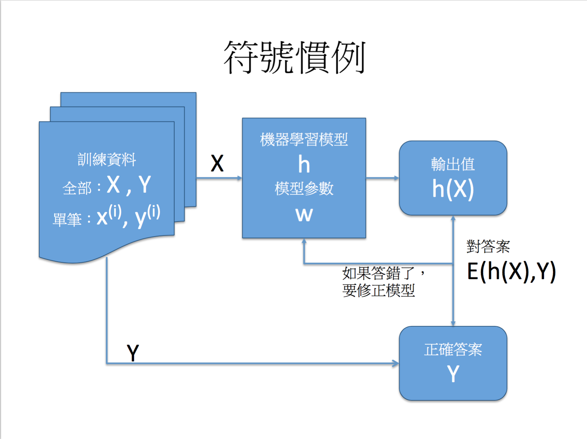
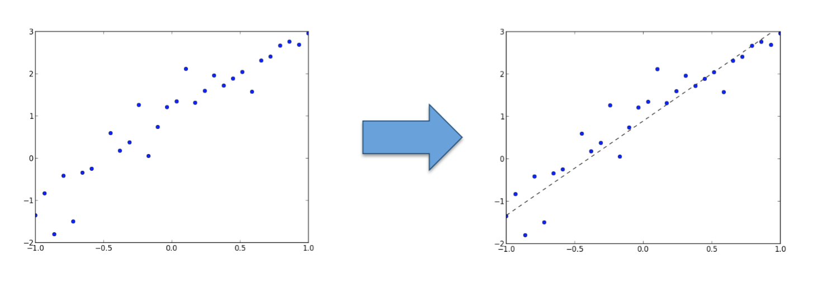
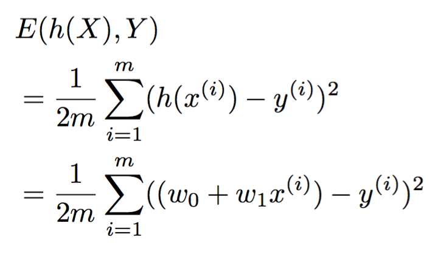
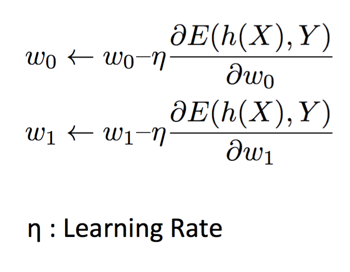
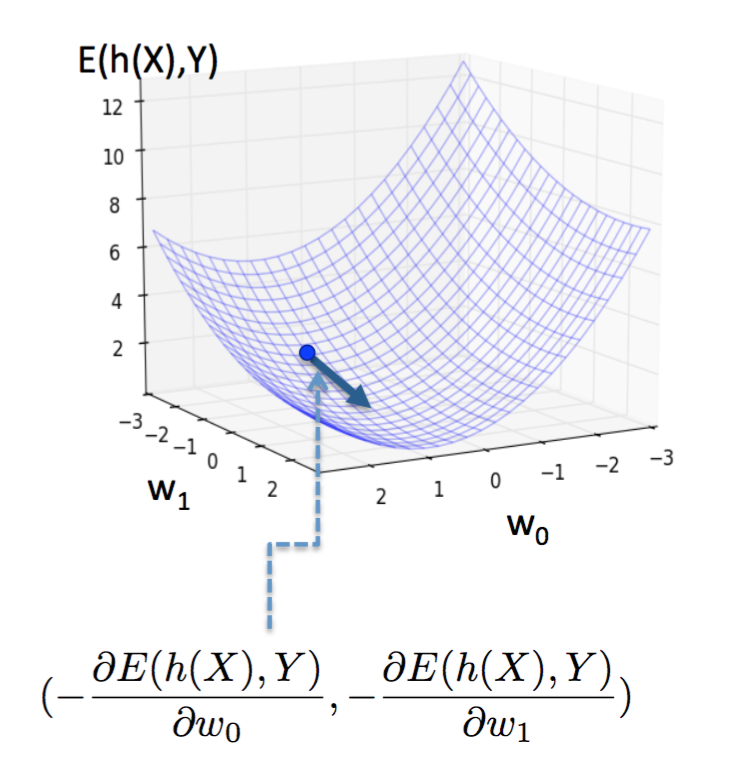
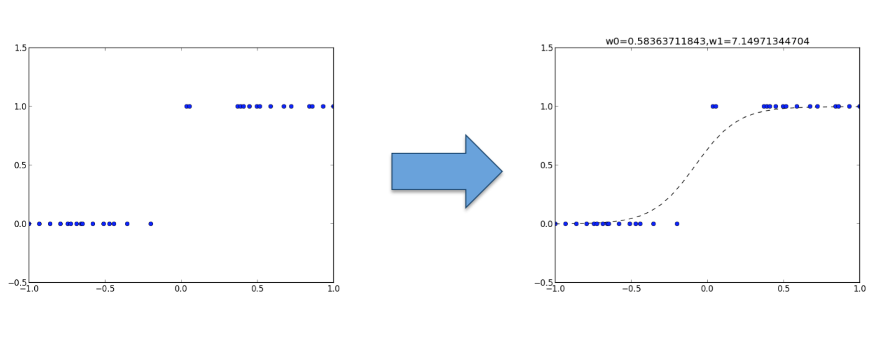
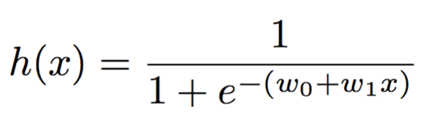
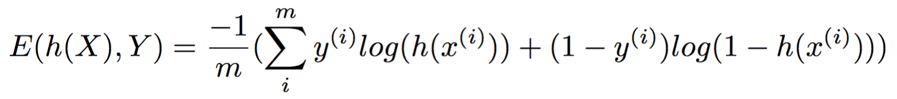
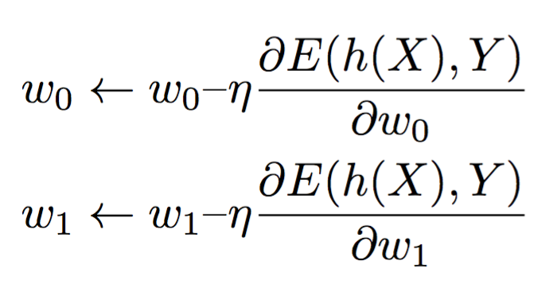
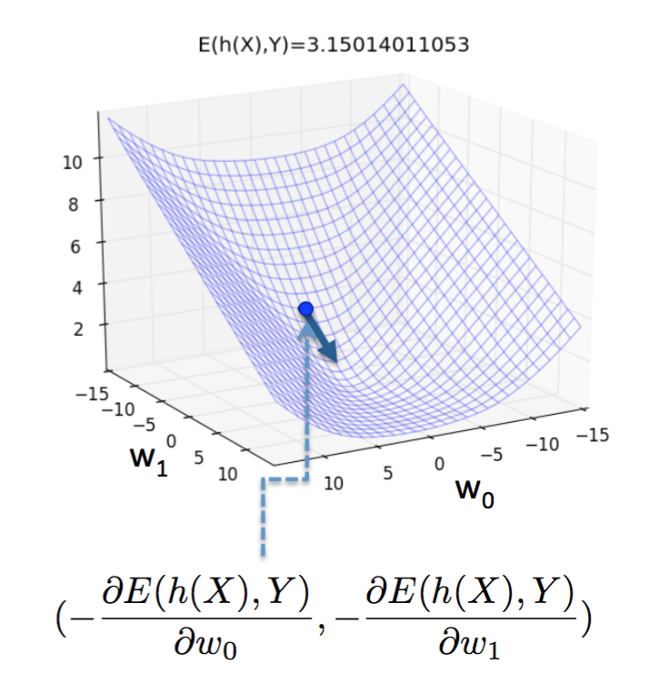

# 機器學習簡介 #

[backup: 機器學習簡介.pdf](機器學習簡介.pdf)

## 監督式學習種類 ##

- 迴歸 (Regression): 答案為一個數值
- 分類 (Classification): 答案為一個類別

## 機器學習模型 ##

- 迴歸：
  - 線性迴歸 (Linear Regression)
- 分類：
  - 邏輯迴歸 (Logistic Regression)

## 符號慣例 ##

## 線性迴歸 ##

> 用直線去逼近資料分佈情形

- 輸入：
  - (x, y), ex: (-1, -1.35083488), (-0.93103448, -0.832318) ...
- 模型：
  - h(x) = w0 + w1x
- Error function：
  - 
- 修正： Gradient Descent
  - 

## 邏輯迴歸 ##

> 用 Sigmoid 曲線去逼近資料的分佈情形

- 輸入：
  - (x, y), ex: (-0.47241379, 0), (-0.35344828, 0), (0.33448276, 1) ...
- 模型：
  - 
- Error function： Cross Entropy
  - 
- 修正： Gradient Descent
  - 

## 延伸閱讀 ##

- Logistic Regression 3D
  - 
- OverFitting and Regularization
  - 
- Model Selection
  - 
- Neural Network Back Propagation
  - 
