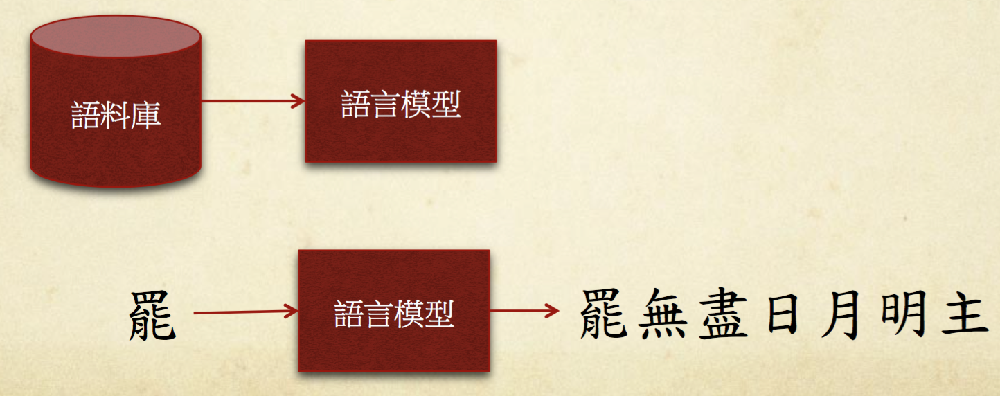
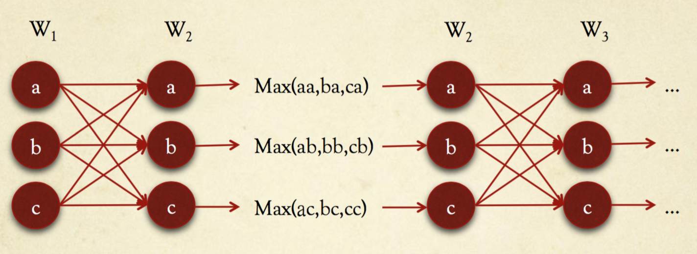

# 藏頭詩產生器 #

[backup: 藏頭詩產生器.pdf](藏頭詩產生器.pdf)

[demo: 反情蒐文字直書產生器](http://antiintelgather.github.io/)

[demo: 藏頭詩產生器](http://poem.kxgen.net/)

## 語料庫 (corpus) ##

> 語言學上意指大量的文本，通常經過整理，具有既定格式與標記

- 蒐集全唐詩兩萬首作為語料庫

## 演算法 ##

- 從`語料庫`建立`語言模型` (Bigram)
- 從語言模型算出`比較有可能出現的句子`
  - Viterbi

## 語言模型 ##

- Unigram
- Bigram

ex:

床前明月光，疑是地上霜。
舉頭望明月，低頭思故鄉。

- Unigram
  - 床|前|明|月|光|疑|是 ...
  - 頭：2, 床：1 ...
- Bigram
  - 床前|前明|明月|月光 ...
  - 明月：2, 明月：1 ...

## 可能的句子 ##

> 若一個句子有五個字，任意挑選五個字，則這五個字符合語言模型的程度，可用機率來表示：

X: position
w: word

P(X1=w1, X2=w2, X3=w3, X4=w4, X5=w5)

= P(X1=w1)

× P(X2=w2|X1=w1)

x P(X3=w3|X2=w2, X1=w1)

x P(X4=w4|X3=w3, X2=w2, X1=w1)

x P(X5=w5|X4=w4, X3=w3, X2=w2, X1=w1)

### Markov Assumption ###

> 每個字出現的機率,只跟前一個字有關

P(X1=w1, X2=w2, X3=w3, X4=w4, X5=w5)

= P(X1=w1) × P(X2=w2|X1=w1) × P(X3=w3|X2=w2) × P(X4=w4|X3=w3) × P(X5=w5|X4=w4)

ex: 白日依山盡

P(X1=白, X2=日, X3=依, X4=山, X5=盡)

= P(X1=白) × P(X2=日|X1=白) × P(X3=依|X2=日) × P(X4=山|X3=依) × P(X5=盡|X4=山)

> P(X2=w2| X1=w1) = P(X1=w1, X2=w2) / P(X1=w1)

> P(X1=w1) = count(unigram(w1)) / count(all unigrams)

> P(X1=w1, X2=w2) = count(bigram(w1, w2)) / count(all bigrams)

## 產生句子 ##

> 給定句子中的首字w1,,找出其他四個字:w2, w3, w4, w5

> 算出使條件機率為最大值的 w2, w3, w4, w5

P(X1=w1, X2=w2, X3=w3, X4=w4, X5=w5 | X1=w1)

= P(X1=w1, X2=w2, X3=w3, X4=w4, X5=w5) / P(X1=w1)

= P(X2=w2|X1=w1) × P(X3=w3|X2=w2) × P(X4=w4|X3=w3) × P(X5=w5|X4=w4)

ex: 給定首字「罷」,產生另外四個字

P(X1=罷, X2=w2, X3=w3, X4=w4, X5=w5 | X1=罷)

= P(X2=w2|X1=罷) × P(X3=w3|X2=w2) × P(X4=w4|X3=w3) × P(X5=w5|X4=w4)

## Bigram Smoothing ##

> 若在Bigram中未出現 w1, w2 組合，則 P(X1=w1, X2=w2) = 0,會使得整個句子機率為 0

> 為了避免此現象發生，令 P(X1=w1, X2=w2) = 0.5 / count(all bigrams)

## 時間複雜度 ##

> 給定 w1 ，求機率最大值的 w2, w3, w4, w5

> 若詞庫大小為V，句子長度為L，則時間複雜度為 O(V^L)

## Viterbi 演算法 ##

- 不需要先把所有組合算出來，再求最大值
- 先算局部的最大值，傳遞下去
- 若詞庫大小為V，句子長度為L，則時間複雜度為 O(LV^2)

ex:

- 先算 Max(aa, ba, ca) ,只保留最大值傳遞下去
- 每層(Wi-1,Wi)需計算 V×V次
- 總共需計算 V×Vx(L-1)

### 缺點 ###

- 語句不夠通順
- 句子和句子之間無關聯性

### 程式碼 ###

- python: [https://github.com/ckmarkoh/AcrosticPoem](https://github.com/ckmarkoh/AcrosticPoem)
- javascript: [https://github.com/ckmarkoh/AcrosticPoemJS](https://github.com/ckmarkoh/AcrosticPoemJS)

## 後續改良方法 ##

- Machine Translation
  - Phrase-based SMT Model: [http://couplet.msra.cn/app/couplet.aspx](http://couplet.msra.cn/app/couplet.aspx)
- Neural Network
  - Neural Probabilistic Language Model
  - Multiplicative Recurrent Neural Network [http://www.cs.toronto.edu/~ilya/rnn.html](http://www.cs.toronto.edu/~ilya/rnn.html)
