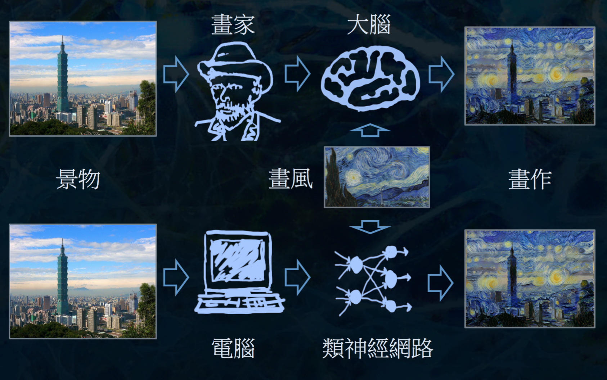
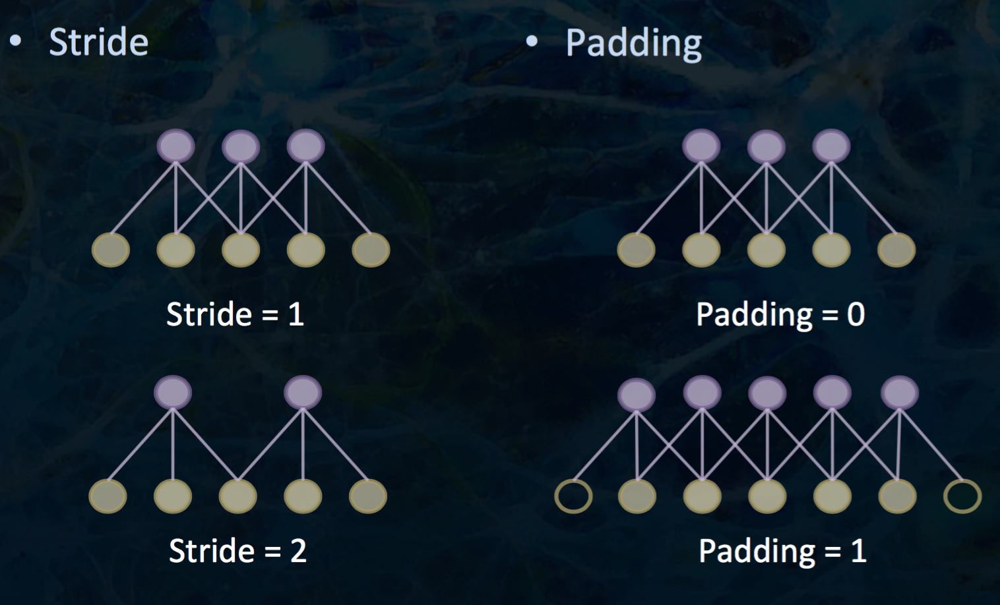
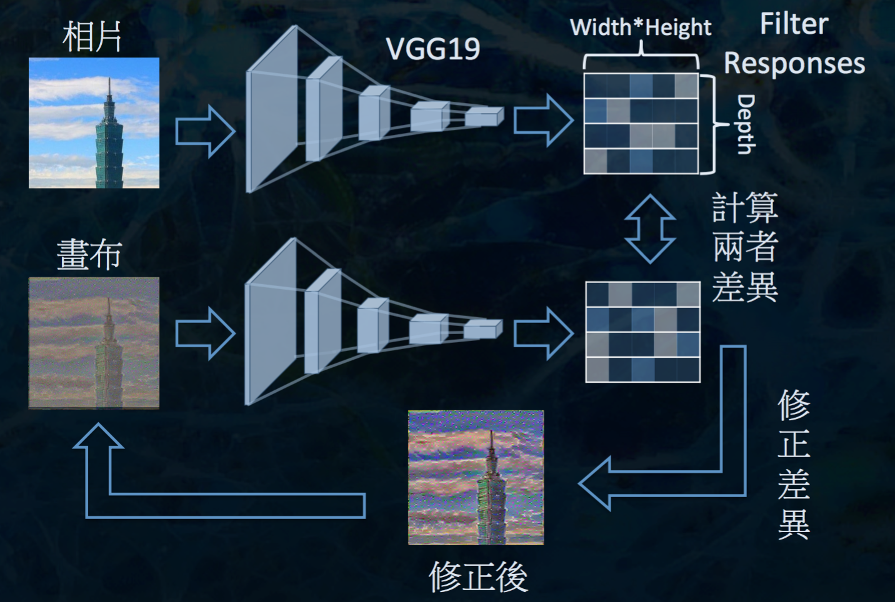
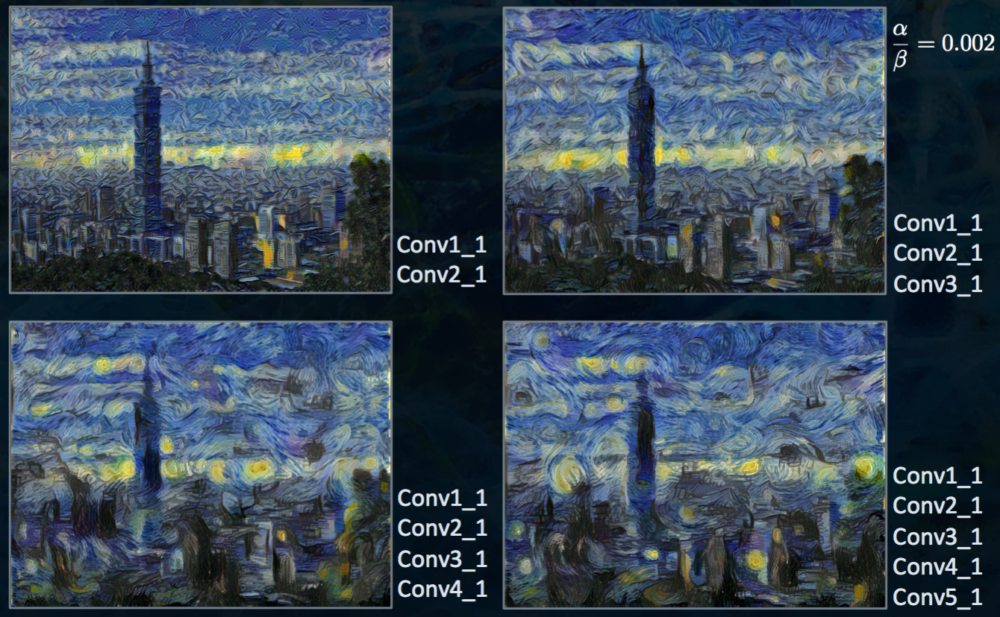

# 電腦作畫 #

- A Neural Algorithm of Artistic Style
  - 作者：Leon A. Gatys, Alexander S. Ecker, MaAhias Bethge

## 如何作畫 ##

## 視覺傳遞路徑 ##

## 電腦視覺 ##

- Neural Networks
- Convolutional Neural Networks
- VGG 19

### Neural Networks ###

- h(x)
  - Sigmoid: 在多層網路中容易發生 gradient vanish
  - Rectified Linear

### Convolutional Neural Networks ###

- shared weight: 用同一種 weight ，降低模型複雜度

- Stride
- Padding

- Pooling Layer
  - Maximum Pooling
  - Average Pooling

- Receptive Fields

### VGG 19 ###

- Very Deep Convolutional Networks for Large-scale Image Recognition.
- 19 (+5) layers
  - 16 Convolutional layers (width=3, height=3)
  - 5 Max-pooling layers (width=2, height=2)
  - 3 Fully-connected layers

## 內容產生 ##

- 人類

- VGG19

### 符號 ###

### Backward Propagation ###

Note: BP 修正的是畫布而非 weights

## 畫風產生 ##

- ”Style” is position-independent

- 抽取過程：隨機將部分圖片遮掉
- "G"

- p: 欲抽取 "內容" 的畫作
- a: 欲抽取 "畫風" 的畫作
- x: 欲渲染的畫布

Note:

Ltotal = alpha * Lcontent + belta * Lstyle => alpha, belta 控制畫作偏寫實或抽象

## 內容 vs 畫風 ##

## 不同的起始狀態 ##

## 不同的 VGG Layers ##

## 延伸閱讀 ##

## code ##

