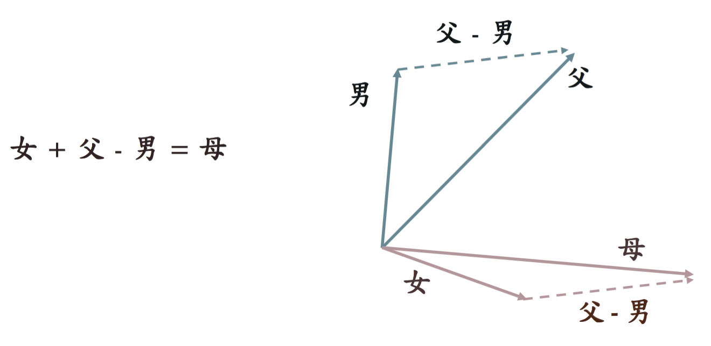

# 電腦賦詩 #

## 如何作詩 ##

## 機器學習簡介 ##

## 類神經網路 ##

- 神經元
  - 構成類神經網路的基本單位
  - 可用機器學習的方式,調整參數,控制其輸出值。
- 由許多神經元組成,可模擬較複雜的函數。

### AND Gate ###

### XOR Gate ###

## 語言理解與類神經網路 ##

### 語意向量簡介 ###

- 語意相近的字,會出現在類似情境的上下文中
- 根據所出現的上下文情境,可建構出每個字的語意向量

- 語意向量可作加減運算,組合出其他語意

ex. 藉由 "父" 與 "男"，得出 "長輩" 關係的語意向量

### 用類神經網路產生語意向量 (word2vec) ###

- 編碼 (One-Hot Encoding)
  - 把字對應到一個n維度的向量,每個維度代表種個字。
  - 每個字的向量中,只有一個維度為1,其餘皆為0。
  - 每個字的向量都互相垂直。

### 遞歸神經網路語言模型 ###

- 語言模型
  - 給一個字串,算出此字串後有可能接續哪些字。
  - 給一個字串,算出此字串在語料庫中出現的機率。
- 語言模型可用於產生
  - 字詞
  - 句子
  - 整首詩

#### Feedforward Neural Networks ####

- 輸出值只跟現在時間的輸入值有關

#### Recurrent Neural Networks ####

- 輸出值跟之前的輸入值都有關

- 短期記憶
  - 閱讀句子的時候,會記得此句曾出現過哪些字

- 整句的語意,會偏重於句子後面的字

#### Convolutional Neural Networks (卷積神經網路) ####

- 平均融合句子中每個字的語意向量

## 用類神經網路產生中文詩 ##

- Chinese Poetry Generation with Recurrent Neural Networks
  - https://github.com/XingxingZhang/rnnpg
- 自動產生藏頭詩

### 訓練語言模型 ###

- 語料庫: 唐詩、宋詩、...,共284,899 首詩。
- 依序將詩詞中的字句,輸入到語言模型中。

- 押韻、平仄之類的格律
  - 從輸出的字中,去挑選符合這些規則的字

## Reference ##

- Vector Space of Semanrics
  - Thomas Mikolov et al. Efficient Estimation of Word Representation in Vector Space
- Recurrent Neural Networks Language Model
  - Thomas Mikolov et al. Recurrent Neural Networks based language model
- Convolutional Neural Networks Sentence Model
  - Nal Kalchbrenner et al. A Convolutional Neural Networks for Modeling
Sentences
- Chinese Poetry Generation with Recurrent Neural Networks
  - Xingxing Zhang and Mirella Lapata. Chinese Poetry Generation with Recurrent Neural Networks

## Further Reading ##

